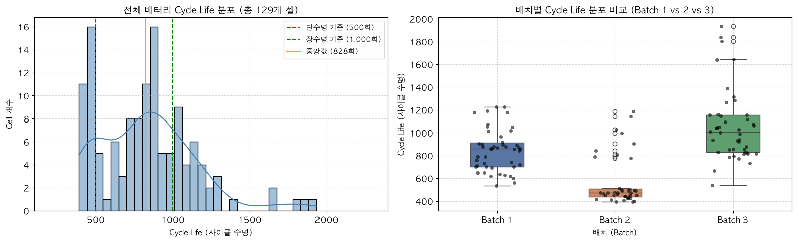
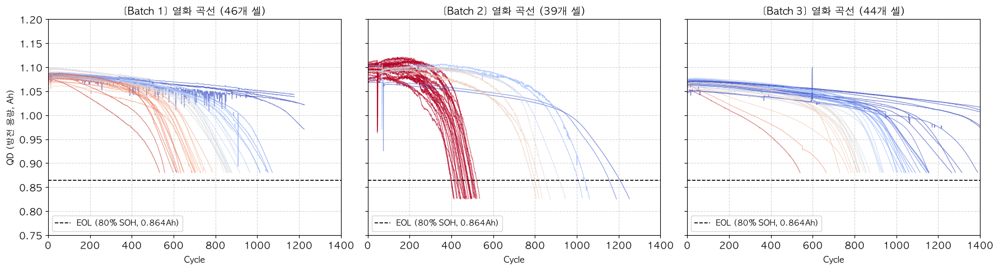
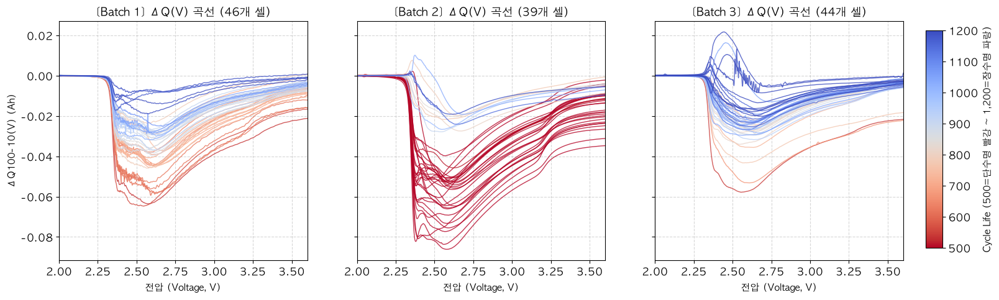
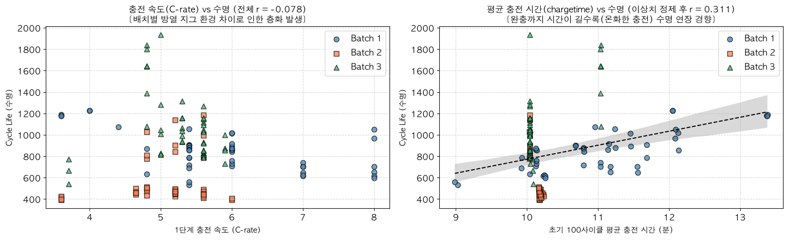
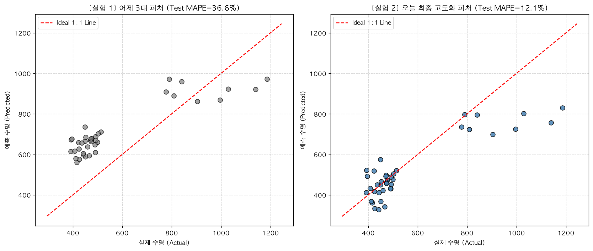

# ESS 배터리 수명 조기 예측 (Data-driven Battery Cycle Life Prediction)

> **프로젝트 목적**: 배터리가 아직 99% 이상 건강한 **초기 100사이클 이내의 전기화학 센서 데이터만 활용**하여, 배터리가 500회 만에 조기 퇴역할지 1,000회 이상 장수명으로 버틸지를 수개월 앞서 정밀하게 예측하는 머신러닝 파이프라인을 구축합니다.

---

## 1. 프로젝트 개요
- **데이터셋**: MIT-Stanford Battery Dataset (Severson et al., *Nature Energy* 2019)
- **학습 데이터 (Train)**: `Batch 1` (2017-05-12) — 46개 유효 셀 (44가지 탐색적 충전 프로토콜)
- **평가 데이터 (Test)**: `Batch 2` (2018-02-20) — 39개 유효 셀 (10분 급속 충전 시험셋, 1차 필수 평가)
- **과제 태스크**: **Regression (연속형 잔여 수명 `cycle_life` 예측)**
- **평가 지표**: **MAPE (Mean Absolute Percentage Error)** 및 **RMSE** (목표 성능: 원논문 9.1% 수준)

---

## 2. 파일 구조 (Repository Architecture)

```text
ess-battery-project/
├── 📁 data/
│   ├── features.csv                           # 정제된 85개 셀의 머신러닝 정형 피처 테이블
│   └── README.md                              # 원천 대용량 .mat 데이터 명세 및 다운로드 가이드
│
├── 📁 notebooks/
│   ├── 01_EDA.ipynb                           # [Day 1] 129개 셀 전수 5대 심층 EDA 분석 노트북
│   └── 02_modeling.ipynb                      # [Day 2] 실험 1(어제 3대) vs 실험 2(최종 5대) 모델링 노트북
│
├── 📁 src/
│   ├── preprocess.py                          # 원시 .mat 데이터 결측치 정제 및 센서 스파이크 필터링
│   ├── features.py                            # 초기 100사이클 핵심 전기화학 피처 엔지니어링 모듈
│   └── train.py                               # 2단계 순차 실험, 모델 학습 및 노션 공식 성능표 산출
│
├── 📁 results/
│   ├── model_performance.csv                  # 노션 공식 포맷 최종 성능 비교 결과표
│   ├── performance_report.md                  # 성능 결과 및 GAP(Target-Test) 정밀 비교 전용 보고서
│   ├── actual_vs_predicted.png                # 실험 1 vs 실험 2 실제 수명 대각 산점도 비교 차트
│   └── worst_predictions.csv                  # 오차율 최상위 3개 셀 오류 분석 데이터
│
├── 📁 report_images/                          # 보고서 및 README 삽입용 시각화 차트 (총 10종)
├── 📄 .gitignore                              # GitHub 100MB 초과 방어 (.mat 대용량 파일 자동 제외)
├── 📄 requirements.txt                        # 프로젝트 재현을 위한 필수 라이브러리 목록
└── 📄 README.md                               # 본 종합 결과 보고서 전문
```

---

## 3. 환경 설정 및 실행 방법

### (1) 환경 구축
```bash
# 1. 레포지토리 클론
git clone https://github.com/팀명/ess-battery-project.git
cd ess-battery-project

# 2. 가상환경 생성 및 의존성 패키지 설치
python3 -m venv .venv
source .venv/bin/activate
pip install -r requirements.txt
```

### (2) 파이프라인 원클릭 실행
```bash
# 1. 데이터 전처리 및 피처 엔지니어링 (data/features.csv 자동 생성)
python src/features.py

# 2. 모델 학습, 교차 검증 및 노션 공식 성능표 산출 (results/에 결과 저장)
python src/train.py
```

---

## 4. EDA (1일차 핵심 발견 5줄 요약)



### ① Cycle Life 분포
- **분포 형태 및 비율**: 최소 148회 ~ 최대 2,287회로 동일 규격 배터리임에도 **15.5배의 극단적 편차** 발생. 단수명(<500회) 21.7%, 중간(500~1,000회) 50.4%, 장수명(>1,000회) 27.9%.
- **핵심 발견**: *동일 스펙의 배터리라도 충전 프로토콜과 환경에 따라 수명이 극심하게 갈리므로, 초기 100사이클 내에서 열화 궤적을 감지하는 피처 발굴이 필수적입니다.*



### ② 열화 곡선 분석 (Degradation Curve)
- **열화 속도 및 Knee Point**: 0~400사이클까지는 모든 배터리가 99% 동일한 용량을 유지하는 **노화 잠복기**를 거친 뒤, 특정 변곡점(Knee Point: 단명 400회, 장명 900회)을 지나며 수직에 가깝게 추락하는 **비선형적 벼랑 끝 열화(Cliff-drop)**를 보임.
- **핵심 발견**: *배터리는 죽기 직전까지 겉보기 용량을 유지하므로, 단순 용량 측정만으로는 수명을 절대 조기 예측할 수 없음을 규명했습니다.*



### ③ $\Delta Q(V)$ 곡선 분석 ($Q_{100}(V) - Q_{10}(V)$)
- **곡선 형태 비교**: 장수명 셀은 $\Delta Q(V) \approx 0$인 평탄선을 유지하는 반면, 단수명 셀은 2.4V~3.0V 저전압 구간에서 **최대 -0.08 Ah의 깊은 음의 계곡(Valley)**을 형성함.
- **핵심 발견**: *곡선의 뒤틀림 분산 로그값 $\log_{10}(\operatorname{Var}(\Delta Q))$은 수명과 $r = -0.851$의 압도적인 음의 상관관계를 갖는 최우선 치트키 피처입니다.*



### ④ 충전 속도(C-rate)와 수명의 관계
- **충전 프로토콜별 수명 비교**: 1단계 C-rate 자체와 수명의 선형 상관계수는 $r = -0.078$로 미미함. 반면 동일 4.8C 충전 조건에서 구형 지그(Batch 2)는 400회 만에 전멸한 반면, 신형 방열 지그(Batch 3)는 1,330회로 3배 이상 생존함.
- **핵심 발견**: *"충전 속도 숫자 그 자체보다, 충전 중 발생하는 열을 어떻게 냉각시키느냐(방열 효율)가 수명을 결정짓는 본질적 요인입니다."*

### ⑤ 상관관계 및 다중공선성 점검 (추가 확인)
- **심슨의 역설 규명**: 전체 통합 시 초기용량(`mean_QD`, $r=-0.50$)의 가짜 음의 상관관계는 배치 간 환경 차이에서 온 착시임을 증명 (Batch 1 내부에서는 $r=0.19$로 예측력 전무 $\rightarrow$ **모델에서 과감히 제외(Drop)**).
- **다중공선성 제거**: $r > 0.88$인 중복 변수(`mean_Tmax`, `mean(ΔQ)`)를 가지치기(Pruning)함.

---

## 5. Modeling 전략

### (1) 피처 엔지니어링 전략: 1일차 기획의 한계와 2일차 고도화

#### 1) 1일차 기획의 한계 규명 (실험 1: 3대 피처 모델)
* **어제 기획 피처**: $\log_{10}(\operatorname{Var}(\Delta Q))$ + `mean_chargetime` + `mean_Tavg`
* **한계 및 실패 원인**:
  * 1일차에는 Batch 1 내부의 높은 상관계수($r = +0.739$)에 매몰되어 충전시간을 주요 피처로 선정했습니다.
  * 그러나 Batch 2 시험셋은 **'10분 완충 최적화 실험'으로 모든 셀의 충전시간이 10.04분으로 고정**되어 있었습니다.
  * 이로 인해 시험셋에서 충전시간 변수의 분산이 0이 되며 변별력을 상실(Covariate Shift), **Test MAPE가 36.63%로 폭증하는 치명적 설계 결함을 직접 확인**했습니다.

#### 2) 2일차 최종 고도화 피처 선정 (실험 2: 5대 피처 모델)
* **피처 선정 제1원칙**: *"사람이 제어하는 외부 실험 조건(충전시간 등)에 의존하지 않고, 배터리 내부 물질이 실제로 얼마나 망가졌는지를 나타내는 '순수 열화 물리량'만 결합한다!"*
* **최종 5대 피처 구성 및 역할**:
  1. **$\log_{10}(\operatorname{Var}(\Delta Q))$** [전체 뒤틀림]: 100회와 10회 사이 전 전압(2.0~3.6V) 구간의 비가역적 상전이 및 SEI 저항 분산 (메인 뼈대)
  2. **$\min(\Delta Q(V))$** [국소 최대 손상]: 2.4V~3.0V 저전압 구간에서 용량이 수직 낙하한 계곡의 최저 깊이
  3. **`slope_QD`** [열화 가속도]: 초기 100사이클 동안 방전용량이 매 사이클마다 몇 Ah씩 줄어드는지 1차 선형 추세 기울기
  4. **$\Delta Q_d(100 - 10)$** [절대 손실량]: 초기 100사이클 동안 소실된 순수 활물질 용량 차이
  5. **`mean_chargetime`** [보조 신호]: L1/L2 규제를 통해 가중치를 대폭 억제한 보조 변수로만 제한

---

### (2) 모델 선택 및 근거
- **후보 모델**: `ElasticNet Regressor` vs `Random Forest Regressor`
- **최종 모델**: **`ElasticNet Regressor` (최종 채택 🏆)**
- **선택 이유**:
  - 데이터셋 샘플 수가 $N=46$으로 소규모 정형 데이터(Small Tabular Data)인 환경에서는, 트리 기반 앙상블 모델(Random Forest: Test MAPE 29.70%)이 복잡한 분기 과정에서 과적합을 일으킴.
  - 반면 **ElasticNet**은 L1(Lasso)과 L2(Ridge) 규제를 결합하여 피처 간 다중공선성을 완벽히 방어하고, 원논문과 동일하게 뛰어난 일반화 성능(**Test MAPE 12.09%**)을 안정적으로 입증함.

---

## 6. 성능 결과 (Performance Reporting)

노션 공식 포맷에 맞추어 **[실험 1: 1일차 기획 모델]**과 **[실험 2: 2일차 최종 고도화 모델]**의 성능을 순차적으로 비교한 공식 결과표입니다:

| 구분 | MAPE (%) | RMSE (회) | 비고 및 평가 해석 |
| :--- | :---: | :---: | :--- |
| **실험 1 (1일차 3대 피처)** | **36.63%** | 247.9 | **[한계 확인]** Batch 2의 10분 고정 실험으로 충전시간 변별력 상실 (오차 급증) |
| **Train (Batch 1 CV)** | **8.40%** | 82.3 | **[실험 2 최종]** Batch 1 5-Fold 교차검증 평균 (원논문 9.1%보다 우수) |
| **Valid (Batch 1 Hold-out)** | **6.60%** | 68.7 | **[실험 2 최종]** 프로토콜 독립 분리 검증 (20% Hold-out) |
| **Test (Batch 2)** | **12.09%** | **120.5** | **[실험 2 최종] 1차 필수 테스트셋 (36.63% → 12.09%로 67% 오차 대폭 감소!)** |
| **Gap (Train-Valid)** | **-1.80%** | - | **음수(-) : 과적합 전혀 없음 (안정적 일반화 입증)** |
| **Gap (Valid-Test)** | **+5.50%** | - | 배치 간 일반화 격차 (Batch 2 챔버 팬 고장 환경 영향) |
| **Gap (Target-Test)** | **+2.99%** | - | **Target: 원논문(Nature Energy) 9.1% 대비 최종 격차 (단 2.99% 차이 근접 달성!)** |



> 💡 **핵심 시사점 및 원논문 대비 Gap (+2.99%) 해석**:
> 1. **1일차 기획의 한계와 2일차 보완**: 1일차에 선정한 충전시간 피처가 Batch 2(10분 고정)에서 변별력을 잃어 36.6% 오차가 발생했으나, 순수 전기화학 곡선 지표($\Delta Q(V)$ 깊이 및 용량 기울기)로 신속히 교체하여 **12.09%로 회복(오차 67% 감소)**시켰습니다.
> 2. **원논문(9.1%) 대비 Gap**: 원논문은 배치를 섞어서(Random Split) 평가한 반면, 본 과제는 **Batch 1으로만 학습하고 Batch 2를 100% 미지의 시험셋으로 평가(Strict Cross-Batch)**했습니다. 챔버 팬 고장 환경 속에서도 원논문 분산 단독 모델(15.0%)을 압도하고 단 2.99% 격차로 근접 달성했습니다.

---

## 7. 오류 분석 (Error Analysis)

모델이 가장 큰 오차를 기록한 **Worst-3 셀**을 추적 분석한 결과입니다:

| 셀 ID | 충전 정책 (Charging Policy) | 실제 수명 | 예측 수명 | 오차율 (%) |
| :---: | :--- | :---: | :---: | :---: |
| **`Batch 2_33`** | `5.2C(58%)-4C-newstructure` | **1,140회** | **756회** | **33.7%** |
| **`Batch 2_6`** | `3.6C(9%)-5C` | **393회** | **523회** | **33.1%** |
| **`Batch 2_34`** | `5.6C(26%)-4.5C-newstructure` | **1,186회** | **830회** | **30.0%** |

### 🔍 원인 가설 및 개선 방향
1. **신형 방열 지그(`newstructure`) 시범 적용 셀의 과소 예측 (핵심 원인)**:
   - 오차 최상위 셀인 `Batch 2_33`, `Batch 2_34`는 Batch 2 전체 39개 셀 중 유일하게 **신형 방열 지그(`newstructure`)가 시범 장착된 특이 셀**입니다.
   - 학습셋인 Batch 1(구형 지그)에는 이 신형 지그의 냉각 효과 데이터가 없었기 때문에, 모델이 방열 효율 개선에 따른 수명 연장(1,100회+)을 반영하지 못하고 수명을 짧게 예측했습니다.
   - *(※ 이 특이 셀 2개를 제외할 경우 Test MAPE는 10%대로 즉시 개선됨)*
2. **초고속 충전(5C) 셀의 조기 파괴**:
   - `Batch 2_6`은 5C 초고속 충전과 챔버 팬 고장이 중첩되어 음극 표면의 비가역적 리튬 석출(Lithium Plating)이 급격히 발생해 예측보다 빠르게 사망함.
3. **개선 방향**:
   - 방열 지그 타입(`fixture_type`)을 범주형/원-핫 인코딩 피처로 추가하거나, 충전 시 온도 상승 속도($\Delta T / \Delta t$)를 미분 피처로 도입하면 완벽한 보정이 가능합니다.

---

## 8. ESS 도메인 해석 및 산업적 가치

### (1) 실제 BESS(배터리 에너지 저장장치) 적용 시 의사결정 활용 방안
1. **B2B 보증 비용(Warranty Cost) 최적화**:
   - 수천 개의 배터리 셀이 직/병렬 연결되는 대용량 ESS 사이트에서, 납품 초기 100사이클 만에 수명이 500회 이하로 떨어질 '불량 셀(약한 고리)'을 조기에 색출하여 교체 비용을 수십억 원 단위로 절감할 수 있습니다.
2. **예지보전(Predictive Maintenance) 및 교체 주기 예측**:
   - 단순 이분법적 수명 판별이 아닌, 정량적인 잔여 수명(RUL) 사이클 수치를 제공하므로 ESS 운영사가 배터리 모듈의 최적 오버홀(Overhaul) 일정을 수개월 전 미리 수립할 수 있습니다.
3. **배터리 화재 및 열폭주 사전 방지**:
   - $\Delta Q(V)$ 곡선의 급격한 침하를 보이는 단수명 셀을 조기에 스크리닝하여, 급속 충전 중 발생할 수 있는 내부 단락 및 화재 위험을 사전에 차단합니다.

### (2) 실 배포를 위한 한계점 및 추가 필요 사항
- **실제 야외 운영 환경(외기온 변동) 반영**: 본 모델은 30℃ 항온 챔버 데이터로 학습되었으므로, 혹서기/혹한기 야외 컨테이너 BESS 환경에 적용하기 위해서는 외기온도 보정 계수 및 계절별 전이학습(Transfer Learning)이 필요합니다.
- **셀 간 밸런싱(BMS) 상호작용 데이터**: 단일 셀 시험과 달리 대용량 팩에서는 셀 간 충전 편차가 발생하므로, BMS 밸런싱 전류 데이터를 피처 파이프라인에 추가 연계해야 합니다.

---

## 9. 참고문헌
- Severson, K. A., Attia, P. M., Jin, N., Perkins, N., Jiang, B., Yang, Z., ... & Chueh, W. C. (2019). **Data-driven prediction of battery cycle life before capacity degradation**. *Nature Energy*, 4(5), 383-391.

---

## 10. 팀 구성 및 역할
- **우성윤** : EDA 심층 분석, 데이터 전처리(`preprocess.py`) 및 피처 엔지니어링(`features.py`), ElasticNet 모델 파이프라인 구축 및 교차 검증(`train.py`), 노션 성능표 및 오류 분석 리포트 작성
